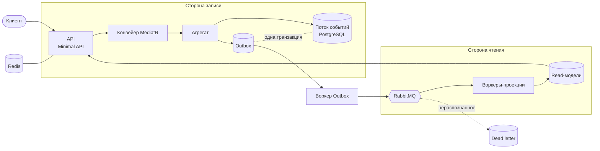

# FinanceTracker

[](https://github.com/nxlllllll/FinanceTracker/actions/workflows/ci.yml)

Финансовая система на .NET 10: event sourcing, CQRS, 12 фоновых воркеров, 66 HTTP-эндпоинтов,
2305 автотестов и полный стек наблюдаемости.

## Идея

FinanceTracker — это имитация банковского приложения без настоящих денег. Счета, переводы,
конвертация валют, лимиты по категориям — всё устроено так, будто где-то на другом конце
стоит настоящий банк. Но платежей на самом деле нет: деньги никуда физически не уходят,
курсы не двигают реальный рынок. Поэтому по сути своей это не банк, а финансовый трекер —
инструмент, который честно фиксирует, что происходит с деньгами пользователя, а не тот,
который ими управляет.

Каждое действие — это не просто изменение записи в базе, а событие, которое случилось и
больше не может быть отменено незаметно: переименовал счёт — это факт, а не перезапись.
Перевёл между счетами — это состоявшееся событие с двумя сторонами, каждая из которых
обязана быть учтена, даже если что-то пошло не так на полпути.

## Что внутри

- Счета в разных валютах с конвертацией по актуальному курсу на дату операции
- Транзакции — доходы и расходы, привязанные к категориям
- Переводы между своими счетами, включая кросс-валютные
- Бюджеты по категориям на период — с прогрессом, который не сбивается при паузе и
  возобновлении бюджета
- Повторяющиеся операции — платежи, которые случаются сами, по расписанию
- Роли и разрешения: доступ проверяется и на входе в API, и в конвейере обработки команд

## Архитектура

Запись и чтение разведены. Команда меняет агрегат и дописывает события в поток; читающая
сторона работает с плоскими read-моделями, которые строят отдельные воркеры-проекции,
получая события из RabbitMQ.



Слои разделены жёстко, и это проверяется тестами, а не договорённостями: `Core` не знает
об `Infrastructure`, `Application` не тянет EF Core, домен не зависит ни от чего внешнего.

| Проект | Назначение |
| --- | --- |
| `FinanceTracker.Core` | Домен: агрегаты, события, value objects, интерфейсы репозиториев |
| `FinanceTracker.Application` | Сценарии, конвейер MediatR, валидация, авторизация |
| `FinanceTracker.Infrastructure` | PostgreSQL, event store, Redis, внешние сервисы |
| `FinanceTracker.Api` | HTTP-слой, 66 эндпоинтов, OpenAPI |
| `FinanceTracker.Contracts` | Интеграционные события между сервисами |
| `FinanceTracker.Worker.*` | 12 фоновых сервисов: проекции, outbox, расписания |
| `FinanceTracker.Migrator` | 58 миграций схемы через DbUp |
| `FinanceTracker.Cli` | Служебные операции: выдача root-прав, перестройка проекций |
| `FinanceTracker.Benchmarks` | Замеры на BenchmarkDotNet |
| `FinanceTracker.Tests` | 2305 тестов всех уровней |

## Ключевые решения

### Event sourcing

Состояние агрегата — не строка в таблице, а свёртка его событий. Источник истины — поток,
поэтому историю нельзя переписать незаметно, а любое состояние воспроизводимо на любой момент.

Что понадобилось, чтобы это работало вдолгую:

- **Снапшоты** — чтобы не переигрывать тысячи событий на каждое чтение агрегата
- **Апкастеры** — события неизменяемы, поэтому старые версии не переписываются,
  а приводятся к текущей форме при чтении
- **Проверка схемы событий на старте** — приложение отказывается подниматься, если контракт
  события несовместим с тем, что уже лежит в потоке; состояние проверки отдаётся через health check
- **Golden-тесты контрактов** — фиксируют сериализованную форму каждого события,
  чтобы её нельзя было сломать случайной правкой

Цена решения: чтение становится eventually consistent, а эволюция контрактов — отдельной
инженерной задачей.

### Транзакционный outbox

База и брокер — разные хранилища, общей транзакции между ними нет. Публиковать сообщение
сразу после `SaveChanges()` означает: потерять событие, если публикация упала, 
или разослать событие о том, чего не произошло, если транзакция откатилась.

Поэтому сообщение пишется в outbox **в той же транзакции**, что и изменение состояния,
а доставкой занимается отдельный воркер. Это даёт at-least-once — и ровно поэтому на стороне
консьюмера есть дедупликация.

### Идемпотентность на двух уровнях

Дубликаты приходят из двух разных мест, и защита от них тоже разная:

| Уровень | От чего защищает | Ключ |
| --- | --- | --- |
| `IdempotencyBehaviour` | Повторная команда клиента: ретрай, двойной клик, таймаут | Приходит от клиента |
| `ProcessedMessage` | Повторная доставка брокером после nack или падения консьюмера | Идентификатор сообщения |

### Перевод как сага

Перевод затрагивает два агрегата — счёт-источник и счёт-получатель. У каждого свой поток
и своя версия, поэтому одной транзакцией их не закрыть, не сломав границу агрегата.
Списание происходит сразу, перевод встаёт в статус `PendingCredit`, зачисление приходит
асинхронно.

В окне между сторонами может упасть что угодно. Поэтому:

1. Фоновая задача находит переводы, застрявшие в `PendingCredit` дольше порога
2. Компенсация возвращает деньги на счёт-источник обратным событием — отменить
   состоявшееся событие в event sourcing нельзя, можно только дописать обратное
3. Если компенсация невозможна, случай эскалируется в журнал неразрешимых событий
   вместо тихой потери денег

### Конвейер обработки команд

Каждая команда проходит через сквозные поведения MediatR: корреляция запроса, трассировка,
валидация, авторизация, ограничение частоты, идемпотентность, повтор транзиентных ошибок,
публикация уведомлений после коммита. Порядок поведений зафиксирован тестом — он важен
и не должен меняться случайно.

### Устойчивость

- Ограничение частоты в Redis с автоматическим переходом на локальный лимитер,
  если Redis недоступен
- Кеширование через декораторы репозиториев — доменный код не знает о существовании кеша
- Отдельный детектор транзиентных ошибок PostgreSQL: повторяем только то,
  что действительно имеет смысл повторять
- Оптимистичная конкуренция по версии агрегата
- Мониторинг очереди недоставленных сообщений отдельным воркером

## Тестирование

2305 тестов в 328 файлах. CI не пропускает сборку с покрытием ниже **85% строк и 65% ветвей**.

| Вид | Что проверяет |
| --- | --- |
| Модульные | Домен, конвейер, обработчики |
| Интеграционные | Реальные PostgreSQL, RabbitMQ и Redis в Testcontainers |
| E2E | Сквозные сценарии: команда → событие → проекция → чтение |
| Chaos | Поведение при отказе Redis и RabbitMQ, при обрыве соединения с клиентом |
| Архитектурные | 30 файлов правил: границы слоёв, обязательные атрибуты, именование колонок, единая денежная точность, уникальность типов событий |
| Мутационные | Stryker — проверяет, что тесты действительно ловят изменения кода |

Архитектурные тесты ловят то, что в event-sourced системе ломается тише всего:
забытую версию агрегата, проекцию без обработчика, событие с занятым типом,
эндпоинт без проверки прав.

## Наблюдаемость

OpenTelemetry как единая точка сбора: метрики уходят в Prometheus, трассировки — в Jaeger,
логи — в Loki через Alloy. Шесть дашбордов Grafana (приложение, PostgreSQL, RabbitMQ,
контейнеры, хост, общий обзор), алерты через Alertmanager, health checks у каждого сервиса.

## Качество кода

- Опасные API запрещены анализатором на уровне всего решения: `DateTime.UtcNow`
  (вместо него — подменяемый `IDateProvider`, иначе время не протестируешь),
  `Guid.NewGuid()` (вместо него — `Guid.CreateVersion7()`, дружественный к индексам),
  `.Result` / `.Wait()` / `GetAwaiter().GetResult()`
- Предупреждения компилятора трактуются как ошибки
- Версии пакетов управляются централизованно
- CI проверяет сборку, тесты, пороги покрытия, формат заголовков pull request и сборку образов

## Запуск

Нужны Docker и Docker Compose.

```bash
git clone https://github.com/nxlllllll/FinanceTracker.git
cd FinanceTracker
cp .env.example .env   # заполните секреты, JWT_SECRET — не короче 32 символов
docker compose --profile app up -d
```

Инфраструктура (PostgreSQL, Redis, RabbitMQ) и миграции поднимаются всегда, остальное
включается профилями:

| Профиль | Что запускает |
| --- | --- |
| `app` | API и 12 воркеров |
| `observability` | Prometheus, Grafana, Loki, Alloy, Jaeger, Alertmanager, экспортёры |
| `ops` | Резервное копирование и просмотр логов |
| `tools` | CLI для служебных операций |

После старта:

| Сервис | Адрес |
| --- | --- |
| API и документация | http://localhost:8080 |
| Grafana | http://localhost:3000 |
| Prometheus | http://localhost:9090 |
| Jaeger | http://localhost:16686 |
| RabbitMQ | http://localhost:15672 |

Тесты запускаются локально и поднимают контейнеры сами:

```bash
dotnet run --project FinanceTracker.Tests
```

## Стек

**.NET 10** · ASP.NET Core Minimal API · MediatR · FluentValidation · EF Core · Npgsql
**PostgreSQL** · **Redis** · **RabbitMQ** · Quartz · DbUp
**TUnit** · Testcontainers · NSubstitute · NetArchTest · Stryker · BenchmarkDotNet
**OpenTelemetry** · Prometheus · Grafana · Loki · Jaeger · Alertmanager
**Docker** · GitHub Actions
